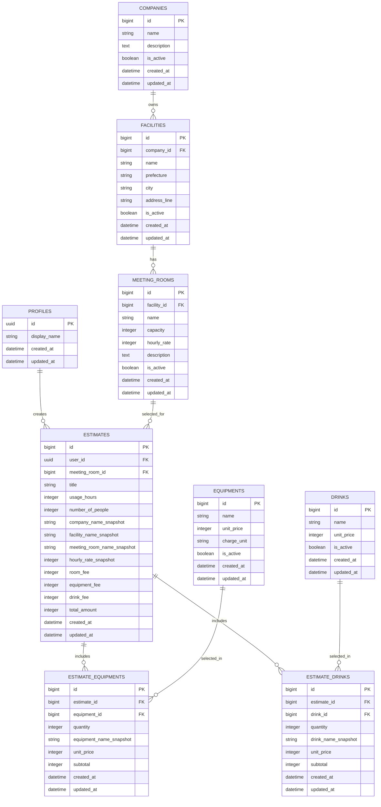

# DB設計・ER図

## 1. この設計の目的

このアプリは、複数の運営会社が提供する貸し会議室の中から、ユーザーが会議室を選び、利用時間・人数・備品・飲み物を入力して、概算料金を確認できる見積もりシミュレーターです。

ログインしたユーザーは、作成した見積もりを保存し、あとから履歴一覧や詳細画面で確認できます。

フロントエンドは React、認証とデータベースは Supabase を使用する想定です。

### 対象機能

- 新規登録
- ログイン
- ログアウト
- 運営会社・施設・会議室の表示
- 会議室の選択
- 利用時間と人数の入力
- 備品と飲み物の選択
- 合計金額の自動計算
- 見積もり保存
- 見積もり履歴一覧
- 見積もり詳細表示

### 対象外の機能

- 予約確定
- 空き状況確認
- 利用日時の予約管理
- 決済
- 管理者画面
- 地図検索
- レビュー
- チャット

このため、予約日時、予約ステータス、空き枠、決済状態などのテーブルやカラムは設けていません。

---

## 2. ER図



---

## 3. 全体構造

データは、大きく次の4つに分かれます。

1. ユーザー情報
2. 会議室情報
3. 料金項目
4. 保存した見積もり

```text
ユーザー
  └─ 見積もり
       ├─ 選択した会議室
       ├─ 選択した備品
       └─ 選択した飲み物

運営会社
  └─ 施設
       └─ 会議室
```

### 会議室を3段階に分ける理由

複数会社が提供する会議室を扱うため、以下を別テーブルに分けています。

- 運営会社：A社、B社など
- 施設：A社新宿店、A社渋谷店など
- 会議室：会議室A、セミナールームなど

1つのテーブルにすべて入れると、同じ会社名や施設名を何度も保存することになり、修正漏れや表記ゆれが起きやすくなります。

会社・施設・会議室を分けることで、データの重複を減らし、関係を明確にしています。

---

## 4. リレーションの説明

### 4.1 companies と facilities

```text
companies 1 : N facilities
```

1つの運営会社は、複数の施設を持てます。

例：

```text
A社
├─ 新宿店
└─ 渋谷店
```

`facilities.company_id` に、どの会社の施設かを保存します。

### 4.2 facilities と meeting_rooms

```text
facilities 1 : N meeting_rooms
```

1つの施設は、複数の会議室を持てます。

例：

```text
新宿店
├─ 会議室A
├─ 会議室B
└─ セミナールーム
```

`meeting_rooms.facility_id` に、どの施設の会議室かを保存します。

### 4.3 profiles と estimates

```text
profiles 1 : N estimates
```

1人のユーザーは、複数の見積もりを保存できます。

`estimates.user_id` に見積もりを作成したユーザーのIDを保存します。

### 4.4 meeting_rooms と estimates

```text
meeting_rooms 1 : N estimates
```

1つの会議室に対して、複数のユーザーが複数の見積もりを作れます。

ただし、1件の見積もりが選択する会議室は1つです。

### 4.5 estimates と equipments

見積もりと備品は多対多の関係です。

- 1件の見積もりで複数の備品を選べる
- 1種類の備品は複数の見積もりで選ばれる

そのため、中間テーブル `estimate_equipments` を置いています。

```text
estimates 1 : N estimate_equipments
 equipments 1 : N estimate_equipments
```

### 4.6 estimates と drinks

見積もりと飲み物も多対多の関係です。

そのため、中間テーブル `estimate_drinks` を置いています。

---

## 5. 各テーブルの詳細

## 5.1 profiles

Supabase Auth のユーザーに紐づくプロフィール情報を保存します。

Supabase Auth の `auth.users` には、ログインに必要なメールアドレスや認証情報が保存されます。アプリ固有の表示名などは `profiles` に保存します。

| カラム | 型 | 内容 |
|---|---|---|
| id | uuid | 主キー。`auth.users.id` と同じ値 |
| display_name | string | アプリ上に表示する名前 |
| created_at | datetime | 作成日時 |
| updated_at | datetime | 更新日時 |

### password を持たせない理由

パスワードは Supabase Auth が安全に管理します。アプリ側の独自テーブルには保存しません。

---

## 5.2 companies

会議室を運営している会社を管理します。

| カラム | 型 | 内容 |
|---|---|---|
| id | bigint | 主キー |
| name | string | 会社名 |
| description | text | 会社の説明 |
| is_active | boolean | 画面に表示するか |
| created_at | datetime | 作成日時 |
| updated_at | datetime | 更新日時 |

### is_active を持たせる理由

会社情報を完全に削除すると、過去のデータとの関係が壊れる可能性があります。そのため、通常は削除せず、非表示状態にできるようにします。

---

## 5.3 facilities

会社が運営する施設・拠点・店舗を管理します。

| カラム | 型 | 内容 |
|---|---|---|
| id | bigint | 主キー |
| company_id | bigint | 運営会社ID |
| name | string | 施設名 |
| prefecture | string | 都道府県 |
| city | string | 市区町村 |
| address_line | string | それ以降の住所 |
| is_active | boolean | 画面に表示するか |
| created_at | datetime | 作成日時 |
| updated_at | datetime | 更新日時 |

### 住所を分ける理由

都道府県や市区町村を分けると、将来的に地域で絞り込む場合に使いやすくなります。

ただし、今回の最低限機能では地図検索は行いません。

---

## 5.4 meeting_rooms

実際にユーザーが選択する会議室を管理します。

| カラム | 型 | 内容 |
|---|---|---|
| id | bigint | 主キー |
| facility_id | bigint | 所属施設ID |
| name | string | 会議室名 |
| capacity | integer | 定員 |
| hourly_rate | integer | 1時間あたりの料金 |
| description | text | 会議室の説明 |
| is_active | boolean | 画面に表示するか |
| created_at | datetime | 作成日時 |
| updated_at | datetime | 更新日時 |

### hourly_rate を持たせる理由

今回の簡易アプリでは、料金計算を分かりやすくするため、会議室ごとに1時間料金を設定します。

```text
部屋料金 = 1時間料金 × 利用時間
```

平日料金、休日料金、時間帯料金などは、今回の対象外です。

---

## 5.5 equipments

選択できる備品を管理します。

例：

- プロジェクター
- ホワイトボード
- マイク
- モニター

| カラム | 型 | 内容 |
|---|---|---|
| id | bigint | 主キー |
| name | string | 備品名 |
| unit_price | integer | 単価 |
| charge_unit | string | 課金単位 |
| is_active | boolean | 画面に表示するか |
| created_at | datetime | 作成日時 |
| updated_at | datetime | 更新日時 |

### charge_unit の例

- per_use：1回あたり
- per_item：1個あたり

最初は `per_use` だけでも実装可能です。

---

## 5.6 drinks

選択できる飲み物を管理します。

例：

- 水
- コーヒー
- お茶

| カラム | 型 | 内容 |
|---|---|---|
| id | bigint | 主キー |
| name | string | 飲み物名 |
| unit_price | integer | 1個または1本あたりの単価 |
| is_active | boolean | 画面に表示するか |
| created_at | datetime | 作成日時 |
| updated_at | datetime | 更新日時 |

---

## 5.7 estimates

保存した見積もりの中心となるテーブルです。

| カラム | 型 | 内容 |
|---|---|---|
| id | bigint | 主キー |
| user_id | uuid | 作成したユーザーID |
| meeting_room_id | bigint | 選択した会議室ID |
| title | string | 見積もりタイトル |
| usage_hours | integer | 利用時間 |
| number_of_people | integer | 利用人数 |
| company_name_snapshot | string | 保存時点の会社名 |
| facility_name_snapshot | string | 保存時点の施設名 |
| meeting_room_name_snapshot | string | 保存時点の会議室名 |
| hourly_rate_snapshot | integer | 保存時点の時間単価 |
| room_fee | integer | 部屋料金 |
| equipment_fee | integer | 備品料金合計 |
| drink_fee | integer | 飲み物料金合計 |
| total_amount | integer | 見積もり総額 |
| created_at | datetime | 作成日時 |
| updated_at | datetime | 更新日時 |

### 見積もりタイトルの例

- 社内研修用
- 8月セミナー見積もり
- 面接会場候補

タイトルは履歴一覧で見分けやすくするために持たせます。

### 利用日時を持たせない理由

このアプリは予約管理ではなく、料金の目安を確認するアプリです。

そのため、利用日、開始時間、終了時間、予約ステータスは保存しません。

### 料金を分けて保存する理由

総額だけでなく、内訳を詳細画面に表示できるようにします。

```text
合計金額
= 部屋料金
+ 備品料金
+ 飲み物料金
```

---

## 5.8 estimate_equipments

1件の見積もりで選択された備品を保存する中間テーブルです。

| カラム | 型 | 内容 |
|---|---|---|
| id | bigint | 主キー |
| estimate_id | bigint | 見積もりID |
| equipment_id | bigint | 備品ID |
| quantity | integer | 数量 |
| equipment_name_snapshot | string | 保存時点の備品名 |
| unit_price | integer | 保存時点の単価 |
| subtotal | integer | 備品ごとの小計 |
| created_at | datetime | 作成日時 |
| updated_at | datetime | 更新日時 |

```text
subtotal = unit_price × quantity
```

---

## 5.9 estimate_drinks

1件の見積もりで選択された飲み物を保存する中間テーブルです。

| カラム | 型 | 内容 |
|---|---|---|
| id | bigint | 主キー |
| estimate_id | bigint | 見積もりID |
| drink_id | bigint | 飲み物ID |
| quantity | integer | 数量 |
| drink_name_snapshot | string | 保存時点の飲み物名 |
| unit_price | integer | 保存時点の単価 |
| subtotal | integer | 飲み物ごとの小計 |
| created_at | datetime | 作成日時 |
| updated_at | datetime | 更新日時 |

---

## 6. スナップショットを保存する理由

見積もりを作成したあとに、会議室名や料金が変更される可能性があります。

たとえば、保存時点では1時間3,000円だった会議室が、後日4,000円に変更されたとします。

見積もりがマスターテーブルの最新料金だけを参照していると、過去に保存した見積もりまで4,000円として表示されてしまいます。

そのため、保存した時点の名称や単価を見積もり側にも保存します。

```text
meeting_rooms.hourly_rate
= 現在の料金

estimates.hourly_rate_snapshot
= 見積もりを作った時点の料金
```

これはデータの重複に見えますが、過去の見積もり内容を正しく維持するために必要な重複です。

---

## 7. 料金計算の考え方

### 部屋料金

```text
room_fee = hourly_rate_snapshot × usage_hours
```

### 備品料金

```text
equipment_fee
= estimate_equipments.subtotal の合計
```

### 飲み物料金

```text
drink_fee
= estimate_drinks.subtotal の合計
```

### 合計料金

```text
total_amount
= room_fee + equipment_fee + drink_fee
```

### 計算場所

React 側で入力内容に応じてリアルタイムに表示します。

保存するときは、計算結果を Supabase の `estimates` と中間テーブルに保存します。

画面表示だけでなくDBにも金額を保存することで、履歴一覧や詳細画面で毎回再計算せずに表示できます。

---

## 8. 主キーと外部キー

### 主キー（PK）

各レコードを一意に識別するための値です。

例：

```text
meeting_rooms.id = 10
```

### 外部キー（FK）

別テーブルの主キーを参照し、テーブル同士の関係を作る値です。

例：

```text
facilities.company_id = companies.id
```

この外部キーにより、存在しない会社IDを施設に登録できないようにします。

---

## 9. 制約

DB側でも不正なデータが入らないように制約を設定します。

### NOT NULL

必須項目が空にならないようにします。

対象例：

- `companies.name`
- `facilities.company_id`
- `meeting_rooms.facility_id`
- `meeting_rooms.name`
- `estimates.user_id`
- `estimates.meeting_room_id`

### CHECK

数値が不正にならないようにします。

```text
meeting_rooms.capacity >= 1
meeting_rooms.hourly_rate >= 0
estimates.usage_hours >= 1
estimates.number_of_people >= 1
金額 >= 0
数量 >= 1
```

### UNIQUE

同じ見積もりに同じ備品や飲み物が二重登録されないようにします。

```text
estimate_equipments
UNIQUE (estimate_id, equipment_id)

estimate_drinks
UNIQUE (estimate_id, drink_id)
```

---

## 10. インデックス

検索や結合を速くするため、よく使う外部キーカラムにインデックスを設定します。

対象：

- `facilities.company_id`
- `meeting_rooms.facility_id`
- `estimates.user_id`
- `estimates.meeting_room_id`
- `estimate_equipments.estimate_id`
- `estimate_drinks.estimate_id`

たとえば、ログインユーザーの見積もり履歴を取得するときは `estimates.user_id` を使います。

---

## 11. Supabase Auth との関係

Supabase Auth は、ログイン用ユーザーを `auth.users` に保存します。

ER図では Supabase 管理領域を簡潔にするため `auth.users` を直接書かず、アプリ側の `profiles` を記載しています。

実際の関係は次のイメージです。

```text
auth.users
   1
   │
   0..1
profiles
   1
   │
   N
estimates
```

- `profiles.id` → `auth.users.id`
- `estimates.user_id` → `auth.users.id`

プロフィール情報が不要なら `profiles` は作らず、`estimates.user_id` から直接 `auth.users.id` を参照する構成も可能です。

今回は表示名を持たせる可能性を考えて `profiles` を用意しています。

---

## 12. RLSの考え方

SupabaseをReactから直接利用する場合、Row Level Security（RLS）を設定します。

RLSは、行単位で「誰がどのデータを操作できるか」を制御する仕組みです。

### 公開マスターデータ

以下はログイン状態に関係なく閲覧可能にする想定です。

- companies
- facilities
- meeting_rooms
- equipments
- drinks

ただし、`is_active = true` のデータだけを画面に表示します。

### ユーザー固有データ

以下は本人のデータだけ操作可能にします。

- profiles
- estimates
- estimate_equipments
- estimate_drinks

### estimates の例

```sql
create policy "Users can view own estimates"
on estimates
for select
using (auth.uid() = user_id);
```

この条件により、ログイン中のユーザーIDと `estimates.user_id` が一致する見積もりだけ取得できます。

---

## 13. 見積もり保存処理

見積もり保存は、概ね次の順序です。

1. Reactで会議室・利用時間・人数・備品・飲み物を選択
2. Reactで料金を計算
3. `estimates` に見積もり本体を保存
4. 保存された `estimate_id` を取得
5. 選択された備品を `estimate_equipments` に保存
6. 選択された飲み物を `estimate_drinks` に保存

複数テーブルへの保存途中で失敗すると不完全なデータが残る可能性があります。

実装時には、SupabaseのDatabase Function（RPC）などを使い、トランザクションとして一括保存する方法も検討できます。

ただし、最初の実装では処理を分け、失敗時に見積もり本体を削除する方法でも対応できます。

---

## 14. 削除時の考え方

### 見積もりを削除する場合

`estimates` を削除したとき、関連する以下も自動削除する設定が適しています。

- estimate_equipments
- estimate_drinks

外部キーに `ON DELETE CASCADE` を設定します。

### 会社・施設・会議室を削除する場合

過去の見積もりとの関係があるため、物理削除ではなく `is_active = false` にする運用を基本とします。

過去の見積もりには名称・単価のスナップショットが残るため、元の会議室が非表示になっても見積もり内容を確認できます。

---

## 15. 今回あえて作っていないテーブル

### reservations

予約確定を行わないため作成しません。

### availability / time_slots

空き状況確認を行わないため作成しません。

### payments

決済機能がないため作成しません。

### administrators

管理者画面を作らないため作成しません。

### reviews

レビュー機能がないため作成しません。

### meeting_room_equipments

会議室ごとに利用可能な備品を制限する設計は、最低限機能の範囲を超えるため今回は作成しません。

現在は全備品を選択候補として表示する想定です。

---

## 16. 今後の拡張例

必要になった場合は、以下の拡張が可能です。

- 会議室ごとに利用可能な備品を設定
- 施設ごとに提供可能な飲み物を設定
- 保存した見積もりの編集・削除
- 見積もり比較
- PDF出力
- メール送信
- 予約リクエスト

ただし、今回のER図では最低限機能に必要な範囲だけを設計しています。

---

## 17. この設計のポイント

1. 複数会社の会議室を扱えるよう、会社・施設・会議室を分けた
2. 認証はSupabase Authに任せ、パスワードを独自管理しない
3. 備品と飲み物は複数選択できるため中間テーブルを使った
4. 過去の見積もりを維持するため、名称と単価のスナップショットを保存した
5. 予約管理や決済には広げず、企画の最低限機能に絞った
6. RLSを利用し、ユーザーが自分の見積もりだけ見られるようにする
