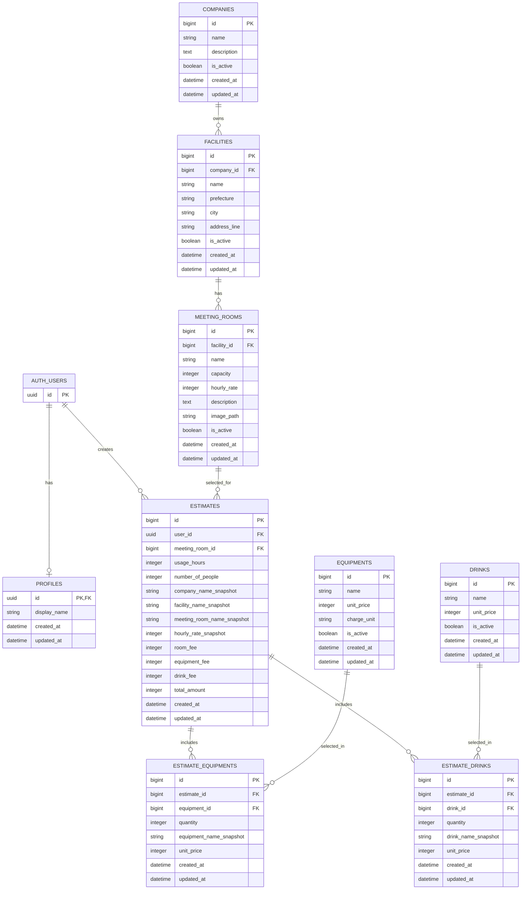

# DB設計・ER図

## 1. この設計の目的

このアプリは、複数の運営会社が提供する貸し会議室の中から、ユーザーが会議室を選び、利用時間・人数・備品・飲み物を入力して、概算料金を確認できる見積もりシミュレーターです。

ログインしたユーザーは、作成した見積もりを保存し、あとから履歴一覧や詳細画面で確認できます。

フロントエンドは React、認証・データベース・画像ストレージは Supabase を使用する想定です。

### 対象機能

- 新規登録
- ログイン
- ログアウト
- 表示名の登録・表示
- 運営会社・施設・会議室の表示
- 会議室画像の表示
- 会議室の選択
- 利用時間と人数の入力
- 備品と飲み物の選択
- 合計金額の自動計算
- 見積もり保存
- 見積もり履歴一覧
- 見積もり詳細表示

### 対象外の機能

- 予約確定
- 空き状況確認
- 利用日時の予約管理
- 決済
- 管理者画面
- 地図検索
- レビュー
- チャット

このため、予約日時、予約ステータス、空き枠、決済状態などのテーブルやカラムは設けていません。

---

## 2. ER図


```mermaid
erDiagram
    COMPANIES ||--o{ FACILITIES : owns
    FACILITIES ||--o{ MEETING_ROOMS : has
    AUTH_USERS ||--o| PROFILES : has
    AUTH_USERS ||--o{ ESTIMATES : creates
    MEETING_ROOMS ||--o{ ESTIMATES : selected_for
    ESTIMATES ||--o{ ESTIMATE_EQUIPMENTS : includes
    EQUIPMENTS ||--o{ ESTIMATE_EQUIPMENTS : selected_in
    ESTIMATES ||--o{ ESTIMATE_DRINKS : includes
    DRINKS ||--o{ ESTIMATE_DRINKS : selected_in

    AUTH_USERS {
        uuid id PK
    }

    PROFILES {
        uuid id PK, FK
        string display_name
        datetime created_at
        datetime updated_at
    }

    COMPANIES {
        bigint id PK
        string name
        text description
        boolean is_active
        datetime created_at
        datetime updated_at
    }

    FACILITIES {
        bigint id PK
        bigint company_id FK
        string name
        string prefecture
        string city
        string address_line
        boolean is_active
        datetime created_at
        datetime updated_at
    }

    MEETING_ROOMS {
        bigint id PK
        bigint facility_id FK
        string name
        integer capacity
        integer hourly_rate
        text description
        string image_path
        boolean is_active
        datetime created_at
        datetime updated_at
    }

    EQUIPMENTS {
        bigint id PK
        string name
        integer unit_price
        string charge_unit
        boolean is_active
        datetime created_at
        datetime updated_at
    }

    DRINKS {
        bigint id PK
        string name
        integer unit_price
        boolean is_active
        datetime created_at
        datetime updated_at
    }

    ESTIMATES {
        bigint id PK
        uuid user_id FK
        bigint meeting_room_id FK
        integer usage_hours
        integer number_of_people
        string company_name_snapshot
        string facility_name_snapshot
        string meeting_room_name_snapshot
        integer hourly_rate_snapshot
        integer room_fee
        integer equipment_fee
        integer drink_fee
        integer total_amount
        datetime created_at
        datetime updated_at
    }

    ESTIMATE_EQUIPMENTS {
        bigint id PK
        bigint estimate_id FK
        bigint equipment_id FK
        integer quantity
        string equipment_name_snapshot
        integer unit_price
        datetime created_at
        datetime updated_at
    }

    ESTIMATE_DRINKS {
        bigint id PK
        bigint estimate_id FK
        bigint drink_id FK
        integer quantity
        string drink_name_snapshot
        integer unit_price
        datetime created_at
        datetime updated_at
    }
```

---

## 3. 全体構造

データは、大きく次の4つに分かれます。

1. 認証ユーザー（Supabase Auth）
2. 会議室情報
3. 料金項目
4. 保存した見積もり

```text
認証ユーザー
  ├─ プロフィール
  └─ 見積もり
       ├─ 選択した会議室
       ├─ 選択した備品
       └─ 選択した飲み物

運営会社
  └─ 施設
       └─ 会議室
```

### 会議室を3段階に分ける理由

複数会社が提供する会議室を扱うため、以下を別テーブルに分けています。

- 運営会社：A社、B社など
- 施設：A社新宿店、A社渋谷店など
- 会議室：会議室A、セミナールームなど

1つのテーブルにすべて入れると、同じ会社名や施設名を何度も保存することになり、修正漏れや表記ゆれが起きやすくなります。

会社・施設・会議室を分けることで、データの重複を減らし、関係を明確にしています。

---

## 4. リレーションの説明

### 4.1 companies と facilities

```text
companies 1 : N facilities
```

1つの運営会社は、複数の施設を持てます。

例：

```text
A社
├─ 新宿店
└─ 渋谷店
```

`facilities.company_id` に、どの会社の施設かを保存します。

### 4.2 facilities と meeting_rooms

```text
facilities 1 : N meeting_rooms
```

1つの施設は、複数の会議室を持てます。

例：

```text
新宿店
├─ 会議室A
├─ 会議室B
└─ セミナールーム
```

`meeting_rooms.facility_id` に、どの施設の会議室かを保存します。

### 4.3 auth.users と profiles

```text
auth.users 1 : 0..1 profiles
```

1人の認証ユーザーは、0件または1件のプロフィールを持ちます。

`profiles.id` には対応する `auth.users.id` と同じ値を保存します。

### 4.4 auth.users と estimates

```text
auth.users 1 : N estimates
```

1人のユーザーは、複数の見積もりを保存できます。

`estimates.user_id` に見積もりを作成したユーザーの `auth.users.id` を保存します。

### 4.5 meeting_rooms と estimates

```text
meeting_rooms 1 : N estimates
```

1つの会議室に対して、複数のユーザーが複数の見積もりを作れます。

ただし、1件の見積もりが選択する会議室は1つです。

### 4.6 estimates と equipments

見積もりと備品は多対多の関係です。

- 1件の見積もりで複数の備品を選べる
- 1種類の備品は複数の見積もりで選ばれる

そのため、中間テーブル `estimate_equipments` を置いています。

```text
estimates 1 : N estimate_equipments
 equipments 1 : N estimate_equipments
```

### 4.7 estimates と drinks

見積もりと飲み物も多対多の関係です。

そのため、中間テーブル `estimate_drinks` を置いています。

---

## 5. 各テーブルの詳細

認証情報は Supabase Auth の `auth.users` で管理し、アプリ独自の表示名は `profiles` で管理します。

## 5.1 profiles

Supabase Authのユーザーに紐づくプロフィール情報を保存します。

| カラム | 型 | 内容 |
|---|---|---|
| id | uuid | 主キー。`auth.users.id` と同じ値 |
| display_name | string | アプリ上に表示する名前 |
| created_at | datetime | 作成日時 |
| updated_at | datetime | 更新日時 |

パスワードやメールアドレスなどの認証情報はSupabase Authが管理するため、`profiles` には保存しません。

---

## 5.2 companies

会議室を運営している会社を管理します。

| カラム | 型 | 内容 |
|---|---|---|
| id | bigint | 主キー |
| name | string | 会社名 |
| description | text | 会社の説明 |
| is_active | boolean | 画面に表示するか |
| created_at | datetime | 作成日時 |
| updated_at | datetime | 更新日時 |

### is_active を持たせる理由

会社情報を完全に削除すると、過去のデータとの関係が壊れる可能性があります。そのため、通常は削除せず、非表示状態にできるようにします。

---

## 5.3 facilities

会社が運営する施設・拠点・店舗を管理します。

| カラム | 型 | 内容 |
|---|---|---|
| id | bigint | 主キー |
| company_id | bigint | 運営会社ID |
| name | string | 施設名 |
| prefecture | string | 都道府県 |
| city | string | 市区町村 |
| address_line | string | それ以降の住所 |
| is_active | boolean | 画面に表示するか |
| created_at | datetime | 作成日時 |
| updated_at | datetime | 更新日時 |

### 住所を分ける理由

都道府県や市区町村を分けると、将来的に地域で絞り込む場合に使いやすくなります。

ただし、今回の最低限機能では地図検索は行いません。

---

## 5.4 meeting_rooms

実際にユーザーが選択する会議室を管理します。

| カラム | 型 | 内容 |
|---|---|---|
| id | bigint | 主キー |
| facility_id | bigint | 所属施設ID |
| name | string | 会議室名 |
| capacity | integer | 定員 |
| hourly_rate | integer | 1時間あたりの料金 |
| description | text | 会議室の説明 |
| image_path | string | Supabase Storage内の代表画像のパス。画像がない場合はNULL |
| is_active | boolean | 画面に表示するか |
| created_at | datetime | 作成日時 |
| updated_at | datetime | 更新日時 |

### hourly_rate を持たせる理由

今回の簡易アプリでは、料金計算を分かりやすくするため、会議室ごとに1時間料金を設定します。

```text
部屋料金 = 1時間料金 × 利用時間
```

平日料金、休日料金、時間帯料金などは、今回の対象外です。

### 会議室画像の保存方法

画像本体はデータベースに保存せず、Supabase StorageのPublic bucketに保存します。会議室は一般公開する情報であり、ログインしていないユーザーにも画像を表示するためです。

```text
bucket名
meeting-room-images

画像の保存例
meeting-rooms/10/main.webp

meeting_rooms.image_path に保存する値
meeting-rooms/10/main.webp
```

DBには公開URL全体ではなく、Storage内のパスだけを保存します。React側で `getPublicUrl(image_path)` を使用して表示用URLを取得します。パスだけを持つことで、プロジェクトURLや配信方法が変わった場合にもDBの値を変更せずに対応しやすくなります。

Public bucketでも、アップロード・更新・削除まで誰でも可能になるわけではありません。今回は管理者画面を作らないため、画像はSupabase Dashboardなどの管理環境から登録し、一般ユーザーには読み取りだけを許可します。

画像は見積もりの金額や内容を確定する情報ではないため、見積もり側には画像のスナップショットを保存しません。

複数画像が必要になった場合は、将来 `meeting_room_images` テーブルを追加し、`meeting_room_id`、`image_path`、`display_order` などを管理します。今回の最低限機能では、`meeting_rooms.image_path` に代表画像1枚を保存する構成とします。

---

## 5.5 equipments

選択できる備品を管理します。

例：

- プロジェクター
- ホワイトボード
- マイク
- モニター

| カラム | 型 | 内容 |
|---|---|---|
| id | bigint | 主キー |
| name | string | 備品名 |
| unit_price | integer | 単価 |
| charge_unit | string | 課金単位 |
| is_active | boolean | 画面に表示するか |
| created_at | datetime | 作成日時 |
| updated_at | datetime | 更新日時 |

### charge_unit の例

- per_use：1回あたり
- per_item：1個あたり

最初は `per_use` だけでも実装可能です。

---

## 5.6 drinks

選択できる飲み物を管理します。

例：

- 水
- コーヒー
- お茶

| カラム | 型 | 内容 |
|---|---|---|
| id | bigint | 主キー |
| name | string | 飲み物名 |
| unit_price | integer | 1個または1本あたりの単価 |
| is_active | boolean | 画面に表示するか |
| created_at | datetime | 作成日時 |
| updated_at | datetime | 更新日時 |

---

## 5.7 estimates

保存した見積もりの中心となるテーブルです。

| カラム | 型 | 内容 |
|---|---|---|
| id | bigint | 主キー |
| user_id | uuid | 作成したユーザーID |
| meeting_room_id | bigint | 選択した会議室ID |
| usage_hours | integer | 利用時間 |
| number_of_people | integer | 利用人数 |
| company_name_snapshot | string | 保存時点の会社名 |
| facility_name_snapshot | string | 保存時点の施設名 |
| meeting_room_name_snapshot | string | 保存時点の会議室名 |
| hourly_rate_snapshot | integer | 保存時点の時間単価 |
| room_fee | integer | 部屋料金 |
| equipment_fee | integer | 備品料金合計 |
| drink_fee | integer | 飲み物料金合計 |
| total_amount | integer | 見積もり総額 |
| created_at | datetime | 作成日時 |
| updated_at | datetime | 更新日時 |

### 利用日時を持たせない理由

このアプリは予約管理ではなく、料金の目安を確認するアプリです。

そのため、利用日、開始時間、終了時間、予約ステータスは保存しません。

### 料金を分けて保存する理由

総額だけでなく、内訳を詳細画面に表示できるようにします。

```text
合計金額
= 部屋料金
+ 備品料金
+ 飲み物料金
```

---

## 5.8 estimate_equipments

1件の見積もりで選択された備品を保存する中間テーブルです。

| カラム | 型 | 内容 |
|---|---|---|
| id | bigint | 主キー |
| estimate_id | bigint | 見積もりID |
| equipment_id | bigint | 備品ID |
| quantity | integer | 数量 |
| equipment_name_snapshot | string | 保存時点の備品名 |
| unit_price | integer | 保存時点の単価 |
| created_at | datetime | 作成日時 |
| updated_at | datetime | 更新日時 |

備品ごとの小計は `unit_price × quantity` で算出できるため、カラムとしては保存しません。

---

## 5.9 estimate_drinks

1件の見積もりで選択された飲み物を保存する中間テーブルです。

| カラム | 型 | 内容 |
|---|---|---|
| id | bigint | 主キー |
| estimate_id | bigint | 見積もりID |
| drink_id | bigint | 飲み物ID |
| quantity | integer | 数量 |
| drink_name_snapshot | string | 保存時点の飲み物名 |
| unit_price | integer | 保存時点の単価 |
| created_at | datetime | 作成日時 |
| updated_at | datetime | 更新日時 |

飲み物ごとの小計は `unit_price × quantity` で算出できるため、カラムとしては保存しません。

---

## 6. 削除した項目と削除理由

今回の最低限機能に必要かどうかと、既存カラムから計算できるかどうかを基準に、以下を削除しました。

### estimates.title

見積もりに任意のタイトルを付ける機能は、今回の最低限機能に含めないため削除しました。

見積もり履歴は、保存時点の会議室名、作成日時、人数、利用時間、合計金額などで識別できます。

### estimate_equipments.subtotal

備品ごとの小計は、保存済みの `unit_price × quantity` で常に算出できるため削除しました。

### estimate_drinks.subtotal

飲み物ごとの小計も、保存済みの `unit_price × quantity` で常に算出できるため削除しました。

`subtotal` のような計算可能な値を明細ごとに保存しないことで、単価や数量と小計が一致しない状態を防げます。

なお、`equipment_title` というカラムは元の設計にはありません。該当する名称項目である `equipment_name_snapshot` は、次の理由から残しています。

---

## 7. スナップショットを保存する理由

見積もりを作成したあとに、会議室名や料金が変更される可能性があります。

たとえば、保存時点では1時間3,000円だった会議室が、後日4,000円に変更されたとします。

見積もりがマスターテーブルの最新料金だけを参照していると、過去に保存した見積もりまで4,000円として表示されてしまいます。

そのため、保存した時点の名称や単価を見積もり側にも保存します。

```text
meeting_rooms.hourly_rate
= 現在の料金

estimates.hourly_rate_snapshot
= 見積もりを作った時点の料金
```

名称についても同様です。備品名が「モニター」から「大型モニター」に変更された場合、マスターの最新名称だけを参照すると、過去の見積もりの表示内容まで変わってしまいます。

このため、次の値は保存時点の内容として残します。

- `estimates.company_name_snapshot`
- `estimates.facility_name_snapshot`
- `estimates.meeting_room_name_snapshot`
- `estimates.hourly_rate_snapshot`
- `estimate_equipments.equipment_name_snapshot`
- `estimate_equipments.unit_price`
- `estimate_drinks.drink_name_snapshot`
- `estimate_drinks.unit_price`

スナップショットを残す主な理由は次のとおりです。

- マスターの名称や料金が変更されても、過去の見積もりを作成時の内容で表示できる
- 見積もりの金額を、作成時の単価に基づいて再現できる
- マスターを非表示にしたあとも、見積もりの明細を確認できる
- 詳細画面やPDF出力などで、保存時点の内容を一貫して使用できる

スナップショットはマスターデータとの重複に見えますが、あとから再計算できる `subtotal` とは異なり、変更前の名称や単価は現在のマスターから復元できません。そのため、過去の見積もり内容を正しく維持するために必要なデータです。

---

## 8. 料金計算の考え方

### 部屋料金

```text
room_fee = hourly_rate_snapshot × usage_hours
```

### 備品料金

```text
equipment_fee
= estimate_equipments の (unit_price × quantity) の合計
```

### 飲み物料金

```text
drink_fee
= estimate_drinks の (unit_price × quantity) の合計
```

### 合計料金

```text
total_amount
= room_fee + equipment_fee + drink_fee
```

### 計算場所

React 側で入力内容に応じてリアルタイムに表示します。

保存するときは、計算結果を Supabase の `estimates` と中間テーブルに保存します。

画面表示だけでなくDBにも金額を保存することで、履歴一覧や詳細画面で毎回再計算せずに表示できます。

---

## 9. 主キーと外部キー

### 主キー（PK）

各レコードを一意に識別するための値です。

例：

```text
meeting_rooms.id = 10
```

### 外部キー（FK）

別テーブルの主キーを参照し、テーブル同士の関係を作る値です。

例：

```text
facilities.company_id = companies.id
```

この外部キーにより、存在しない会社IDを施設に登録できないようにします。

---

## 10. 制約

DB側でも不正なデータが入らないように制約を設定します。

### NOT NULL

必須項目が空にならないようにします。

対象例：

- `companies.name`
- `facilities.company_id`
- `meeting_rooms.facility_id`
- `meeting_rooms.name`
- `estimates.user_id`
- `estimates.meeting_room_id`

### CHECK

数値が不正にならないようにします。

```text
meeting_rooms.capacity >= 1
meeting_rooms.hourly_rate >= 0
estimates.usage_hours >= 1
estimates.number_of_people >= 1
金額 >= 0
数量 >= 1
```

### UNIQUE

同じ見積もりに同じ備品や飲み物が二重登録されないようにします。

```text
estimate_equipments
UNIQUE (estimate_id, equipment_id)

estimate_drinks
UNIQUE (estimate_id, drink_id)
```

---

## 11. インデックス

検索や結合を速くするため、よく使う外部キーカラムにインデックスを設定します。

対象：

- `facilities.company_id`
- `meeting_rooms.facility_id`
- `estimates.user_id`
- `estimates.meeting_room_id`
- `estimate_equipments.estimate_id`
- `estimate_drinks.estimate_id`

たとえば、ログインユーザーの見積もり履歴を取得するときは `estimates.user_id` を使います。

---

## 12. Supabase Auth との関係

Supabase Auth は、ログイン用ユーザーを `auth.users` に保存します。

ER図の `AUTH_USERS` は、Supabaseが管理する `auth.users` を表しています。認証情報は `auth.users`、アプリで表示する名前は `profiles` に分けて保存します。

```text
auth.users
   1
   ├── 0..1 profiles
   └── N estimates
```

- `profiles.id` → `auth.users.id`
- `estimates.user_id` → `auth.users.id`

`profiles` が作成されていない状態でも認証や見積もりの所有者管理ができるように、`estimates.user_id` は `profiles.id` ではなく `auth.users.id` を直接参照します。

---

## 13. RLSの考え方

SupabaseをReactから直接利用する場合、Row Level Security（RLS）を設定します。

RLSは、行単位で「誰がどのデータを操作できるか」を制御する仕組みです。

### 公開マスターデータ

以下はログイン状態に関係なく閲覧可能にする想定です。

- companies
- facilities
- meeting_rooms
- equipments
- drinks

ただし、`is_active = true` のデータだけを画面に表示します。

### 公開画像

Supabase Storageの `meeting-room-images` bucketは、会議室画像を誰でも閲覧できるPublic bucketとします。

画像のアップロード・更新・削除は一般ユーザーに許可せず、Supabase Dashboardなどの管理環境から行います。

### ユーザー固有データ

以下は本人のデータだけ操作可能にします。

- profiles
- estimates
- estimate_equipments
- estimate_drinks

### estimates の例

```sql
create policy "Users can view own estimates"
on estimates
for select
using (auth.uid() = user_id);
```

この条件により、ログイン中のユーザーIDと `estimates.user_id` が一致する見積もりだけ取得できます。

---

## 14. 見積もり保存処理

見積もり保存は、概ね次の順序です。

1. Reactで会議室・利用時間・人数・備品・飲み物を選択
2. Reactで料金を計算
3. `estimates` に見積もり本体を保存
4. 保存された `estimate_id` を取得
5. 選択された備品を `estimate_equipments` に保存
6. 選択された飲み物を `estimate_drinks` に保存

複数テーブルへの保存途中で失敗すると不完全なデータが残る可能性があります。

実装時には、SupabaseのDatabase Function（RPC）などを使い、トランザクションとして一括保存する方法も検討できます。

ただし、最初の実装では処理を分け、失敗時に見積もり本体を削除する方法でも対応できます。

---

## 15. 削除時の考え方

### 見積もりを削除する場合

`estimates` を削除したとき、関連する以下も自動削除する設定が適しています。

- estimate_equipments
- estimate_drinks

外部キーに `ON DELETE CASCADE` を設定します。

### 会社・施設・会議室を削除する場合

過去の見積もりとの関係があるため、物理削除ではなく `is_active = false` にする運用を基本とします。

過去の見積もりには名称・単価のスナップショットが残るため、元の会議室が非表示になっても見積もり内容を確認できます。

---

## 16. 今回あえて作っていないテーブル

### reservations

予約確定を行わないため作成しません。

### availability / time_slots

空き状況確認を行わないため作成しません。

### payments

決済機能がないため作成しません。

### administrators

管理者画面を作らないため作成しません。

### reviews

レビュー機能がないため作成しません。

### meeting_room_equipments

会議室ごとに利用可能な備品を制限する設計は、最低限機能の範囲を超えるため今回は作成しません。

現在は全備品を選択候補として表示する想定です。

---

## 17. 今後の拡張例

必要になった場合は、以下の拡張が可能です。

- 会議室ごとに利用可能な備品を設定
- 施設ごとに提供可能な飲み物を設定
- 保存した見積もりの編集・削除
- 見積もり比較
- PDF出力
- メール送信
- 予約リクエスト

ただし、今回のER図では最低限機能に必要な範囲だけを設計しています。

---

## 18. この設計のポイント

1. 複数会社の会議室を扱えるよう、会社・施設・会議室を分けた
2. 認証はSupabase Authに任せ、パスワードを独自管理しない
3. アプリ独自の表示名は `profiles` に分けて保存する
4. 備品と飲み物は複数選択できるため中間テーブルを使った
5. 過去の見積もりを維持するため、名称と単価のスナップショットを保存した
6. 会議室の代表画像はSupabase Storageに置き、DBには画像パスだけを保存する
7. 予約管理や決済には広げず、企画の最低限機能に絞った
8. RLSを利用し、ユーザーが自分のデータだけ見られるようにする
